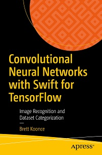

# Apress Source Code

This repository contains the source code/demos for the book [*Convolutional Neural Networks with Swift for TensorFlow*](https://convolutionalneuralnetworkswithswift.com/) by [Brett Koonce](https://brettkoonce.com) ([Apress](https://www.apress.com/9781484261675), 2021).

[comment]: #cover

Download the files as a zip using the green button, or clone the repository to your machine using Git.

## Releases

Release v1.0 corresponds to the code in the published book, without corrections or updates.

To run it locally, you will need a working [swift for tensorflow](https://github.com/tensorflow/swift/) installation.

## Quickstart

Set up GCP.

    export ZONE="us-central1-c"
    export GPU_TYPE="t4"
    
    gcloud compute instances create s4tf-ubuntu-${GPU_TYPE} \
    --zone=${ZONE} \
    --image-project=deeplearning-platform-release \
    --image-family=swift-latest-gpu-ubuntu-1804 \
    --maintenance-policy=TERMINATE \
    --accelerator="type=nvidia-tesla-${GPU_TYPE},count=1" \
    --metadata="install-nvidia-driver=True" \
    --machine-type=n1-highmem-2 \
    --boot-disk-size=256GB
    
    
    git clone https://github.com/Apress/convolutional-neural-networks-with-swift-for-tensorflow.git
    cd convolutional-neural-networks-with-swift-for-tensorflow

    $ swift run
    error: multiple executable products available: VGG, SqueezeNet, Resnet50, Resnet34, MobileNetV3, MobileNetV2, MobileNetV1, MNIST-XLA-TPU, MNIST-2D, MNIST-1D, EfficientNet, CIFAR

Now you can run the individual demos, eg `swift run MNIST-1D`.

# Outline

The book is structured as follows:

## Basic

We will explore the basic building blocks of neural networks and how to combine them with convolutions to perform simple image recognition tasks.

* MNIST-1D
* MNIST-2D
* CIFAR

## Advanced

We will build upon the above to produce actual state of the art approaches in this field.

* VGG
* Resnet34
* Resnet50

## Mobile

We will look at some different approaches for mobile devices, which require us to utilize our computing resources carefully.

* SqueezeNet
* MobileNetV1
* MobileNetV2

## State of the art

We look at the work that leads up to EfficientNet, the current state of art for image recognition.

* EfficientNet
* MobileNetV3

## Future

We look at how swift for tensorflow's use of XLA internally allows our code to scale to large supercomputer clusters.

* MNIST-XLA-TPU

## Contributions

See the file Contributing.md for more information on how you can contribute to this repository.
